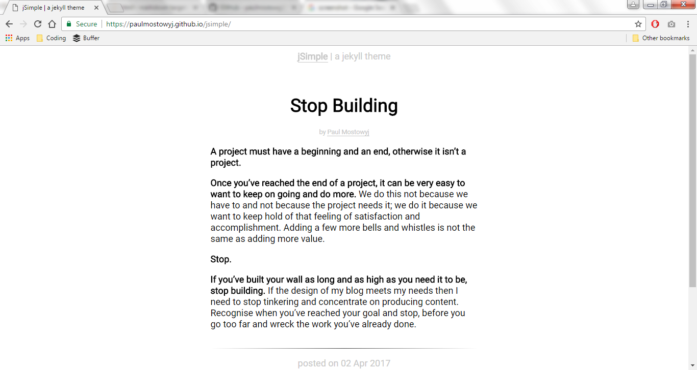

Hi - I'm Paul Mostowyj. It's pronounced *most-o-vee*, but you can call me Paul and I created the jSimple theme for Jekyll web sites. It's a theme inspired by the look and feel of the [Zen Habits](https://zenhabits.net) web site, which strips away all of the bells and whistles to leave what's essential - the content.

## jSimple Features
jSimple includes the following features:
- minimalist design
- footer navigation
- email subscription
- latest post featured on the home page
- posts archived by month
- author name and url tags
- responsive design

## jSimple Screenshot

