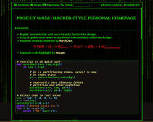

pRoJEct-NeGYa is a hacker-like, highly-customizable theme for note-keeping, personal-website or CV.

**Features**

* Highly customizable
* Formula insertion
* Code test online
* Easy-to-use cheatsheet
* Hacker-like theme
* Code highlight
* Text Decryption
* Convinient code exhibition and review
* Table of content
* Atom Feeds
* SEO